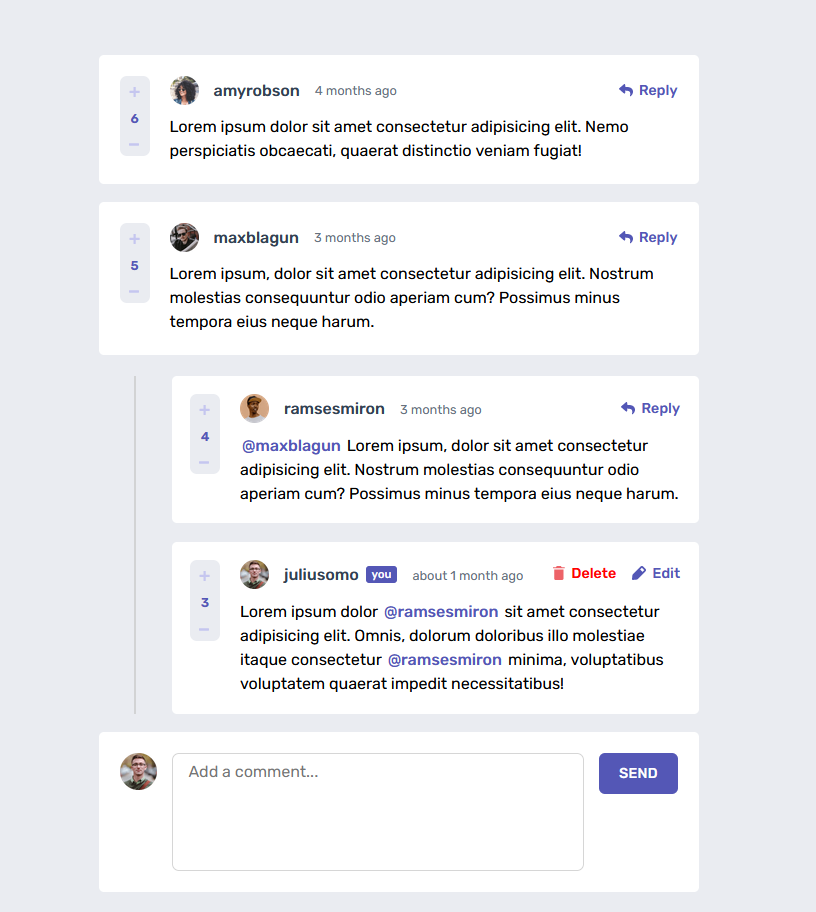
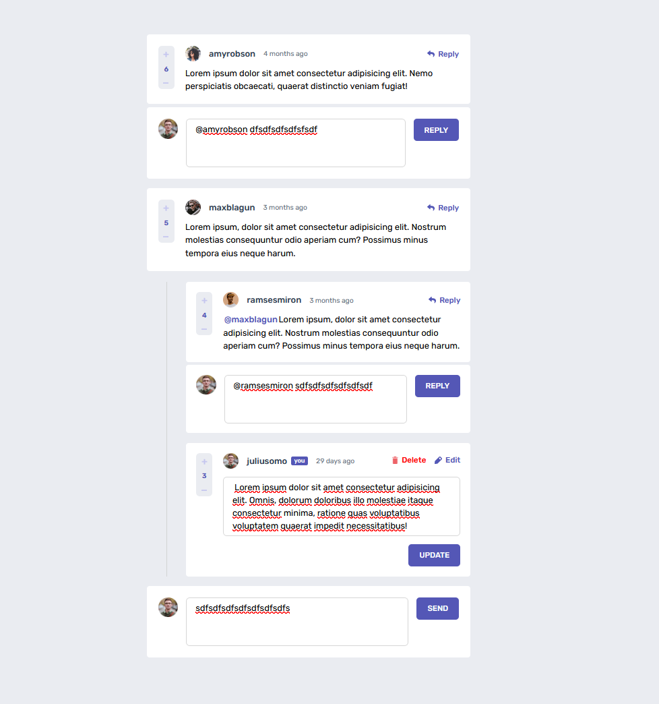
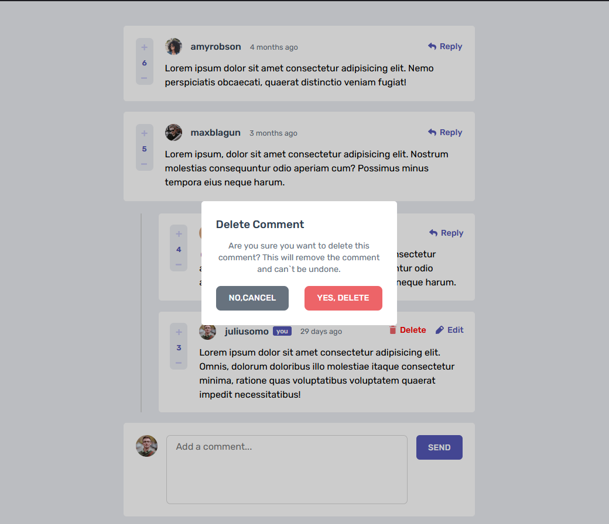
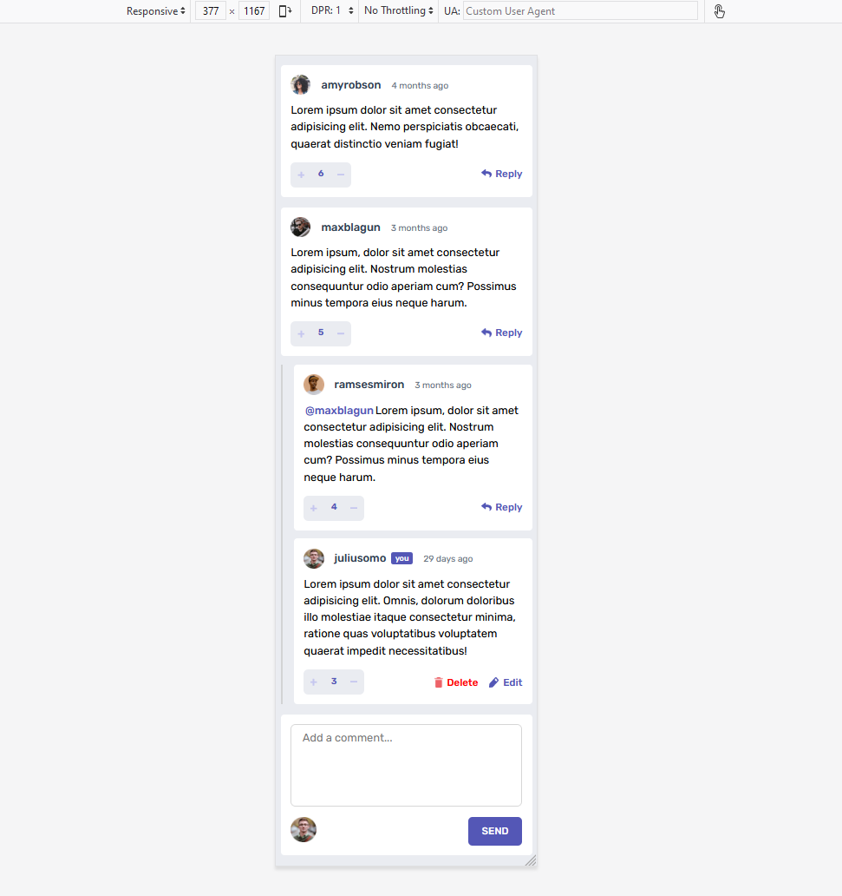
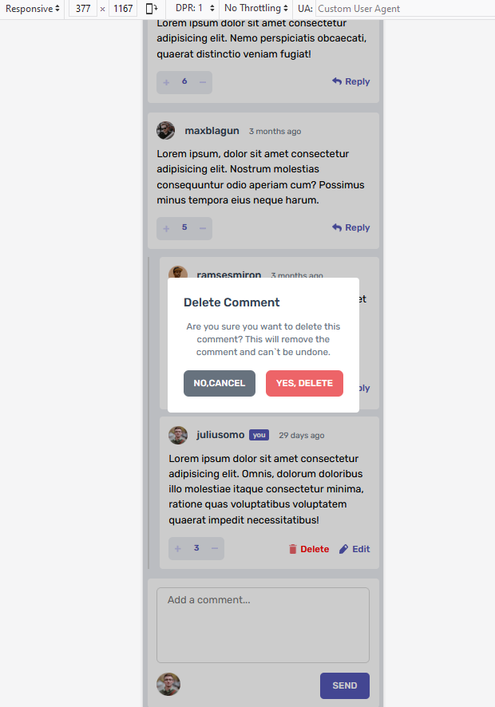
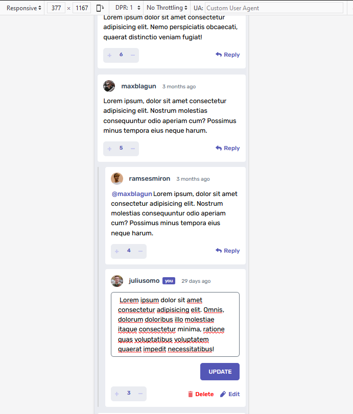

# Responsive Interactive comments section solution

## Overview

### The challenge

Users should be able to:

- View the optimal layout for the app depending on their device's screen size
- See hover states for interactive elements on the page
- Create, Read, Update, and Delete comments and replies
- Upvote and downvote comments but only once in a single comment/reply,user can not vote their own comment.
- the current state in the browser that will persists when the browser is refreshed.
- dynamically track the time since the comment or reply was posted.
- user can tag a single user anywhere or any place in the comment multiple time if the user exist in database it will show in different style than comment words. but within same comment or reply user can only tag single user multiple times not multiple user multiple times within same comment. (i can also do that but for simplicity sake i didn't)

### Screenshot

### Links

- Solution URL: https://github.com/TANJIRWEBDEV/Interactive-comments-section
- Live Site URL: https://lucent-otter-61f684.netlify.app/

## My process

### Built with

- Semantic HTML5 markup
- CSS custom properties
- Flexbox
- CSS Grid
- [React](https://reactjs.org/) - JS library

## Author

- Website - https://github.com/TANJIRWEBDEV
- Frontend Mentor - https://www.frontendmentor.io/profile/TANJIRWEBDEV
- Twitter - https://twitter.com/TanWevDev
